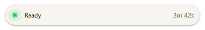
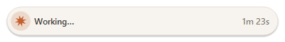
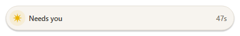

# Claude Indicator

An always-on-top status pill for **Claude Code** on Windows. It shows what Claude is doing right now — even when you've alt-tabbed away to a browser, Discord, or a video.

<p align="center">
  
  
  
</p>

## The three states

| State | Spark | Meaning |
|---|---|---|
| **Ready** | green | Idle, waiting for your next prompt |
| **Working** | terracotta, spinning | Claude is running — shows a whimsical label ("Ruminating…", "Pondering…") and a live elapsed timer |
| **Needs you** | amber, pulsing | A permission prompt or input is blocking Claude (+ system chime) |

The pill **auto-hides while your IDE or terminal is focused** (you can already see Claude there) and **fades back in when you switch to anything else**. It never hides while in the "Needs you" state, so you can't miss a pending permission prompt.

**Multiple sessions:** running Claude Code in several projects at once shows one row per active session, most urgent on top. Each row shows the status spark, label, elapsed time, and the project folder name. Click a row to bring that session's window to the front.

## Requirements

- Windows 10/11
- Python 3.10+ (python.org or Microsoft Store install — both work)
- Claude Code (the indicator is driven by its [hooks](https://docs.anthropic.com/en/docs/claude-code/hooks))

## Installation

```bash
git clone https://github.com/yourusername/claude-indicator.git
cd claude-indicator
pip install -r requirements.txt
python install.py
```

`install.py` merges hook entries into `~/.claude/settings.json` (a `.bak` backup is written first). It registers `hook_handler.py` for these events:

- `SessionStart` / `SessionEnd` — a session appeared / went away
- `UserPromptSubmit`, `PreToolUse`, `PostToolUse` — Claude is working
- `Stop` — Claude finished responding (Ready)
- `Notification` — Claude needs permission or input (Needs you)

You only need to run the installer once; the hooks persist across Claude Code updates. To remove them later: `python install.py --uninstall`.

**Important:** restart any Claude Code sessions that were already open — hooks are read at session start, so pre-existing sessions won't send events.

That's it. **You don't need to start the indicator manually**: the hook handler launches it automatically on the first event if it isn't already running. To start it yourself anyway:

```bash
pythonw indicator.py   # background, no console window
python indicator.py    # foreground, with log output — useful for debugging
```

The pill appears in the top-right corner. Drag it anywhere; the position is saved automatically.

## Configuration

Edit `config.json` (in the repo folder). The indicator reads it once at startup, so restart the pill after changing it:

```json
{
  "hide_on_processes": [
    "Code.exe", "cursor.exe", "WindowsTerminal.exe",
    "wt.exe", "cmd.exe", "powershell.exe", "pwsh.exe"
  ],
  "position": [1792, 48],
  "margin": 16,
  "sound_on_needs_you": true
}
```

| Key | Meaning |
|---|---|
| `hide_on_processes` | Executable names of your IDEs/terminals. When one of these owns the foreground window, the pill hides (unless the state is "Needs you"). |
| `position` | `[x, y]` screen coordinates. Written automatically when you drag the pill; set to `null` to reset to the top-right corner. |
| `margin` | Distance in pixels from the screen edge when auto-positioned. |
| `sound_on_needs_you` | Play a system chime on entering the "Needs you" state. |

## How it works

The design is deliberately simple: **hooks write small JSON files, the indicator polls them**. No sockets, no network, no cloud — everything stays on your machine.

1. **`hook_handler.py`** runs on every registered hook event. It reads the event payload from stdin, maps the event to a status (`working` / `waiting` / `done`), and atomically writes `runtime/sessions/<session_id>.json` (write to temp file + `os.replace`, so the indicator never reads a half-written file). One file per session means writes never contend and no locking is needed. `SessionEnd` deletes the file. The handler also records the owning Claude process PID (found once via a psutil parent-walk, then cached in the session file) so dead sessions can be detected.

2. **`indicator.py`** polls `runtime/sessions/` every 100 ms, aggregates all live sessions (priority: waiting > working > done), and renders the pill with custom Qt painting. Visibility is decided by checking the foreground window's process name against `hide_on_processes`.

A few edge cases the code handles explicitly:

- **Notification disambiguation** — Claude Code fires `Notification` both for permission requests and for a harmless "waiting for your input" idle reminder. The handler inspects the message text and only treats real permission prompts as "Needs you".
- **Killed terminals** — if a terminal is closed without a clean exit, `SessionEnd` never fires. The indicator treats a "working" session as done after 10 minutes of silence (a genuinely working session emits tool events constantly), and also drops sessions whose recorded Claude PID no longer exists. Sessions silent for over 24 hours are ignored entirely.
- **Microsoft Store Python** — runtime files live next to the scripts rather than in `%LOCALAPPDATA%`, because Store Python virtualizes AppData writes per package, which could make the hook and the indicator read two different files.

## Autostart on Windows login

The hooks auto-launch the indicator, so this is optional — but if you want the pill up before the first hook fires:

1. Press `Win+R`, type `shell:startup`, press Enter
2. Create a shortcut in that folder with the target:
   ```
   C:\Path\To\pythonw.exe C:\Path\To\claude-indicator\indicator.py
   ```

Or use Task Scheduler for more control (delayed start, run minimized, etc.).

## Troubleshooting

**The pill stays green while Claude is working.**
That session was started before the hooks were installed. Close all Claude Code sessions and start fresh ones.

**The pill never appears.**
Run `python indicator.py` in a terminal (not `pythonw`) to see errors directly. Check the dependencies with `pip list | findstr "PySide6 psutil pywin32"`. Also check `runtime/hooks.log` and `runtime/indicator.log` — if `hooks.log` is empty, the hooks aren't firing at all (re-run `install.py` and restart your sessions).

**"Needs you" is showing but I already answered.**
Another session probably needs permission — check the project name in that row and click it to jump there. If a session was killed uncleanly, its stale status clears itself after 10 minutes.

**A row is stuck on "Working".**
The terminal running that session was killed without a clean exit. The indicator clears it automatically after 10 minutes of silence, or immediately once the dead Claude process is detected; restarting the indicator forces a fresh scan.

## Customization

All rendering is custom Qt paint code in `indicator.py`, controlled by named constants near the top of the file:

- `CREAM`, `TERRACOTTA`, `GREEN`, `AMBER` — the color palette
- `WORKING_WORDS` — the whimsical working labels
- `ROW_H`, `PILL_W` — row height and pill width
- `POLL_MS` — poll interval (default 100 ms)
- In `_tick()`: `self._spin` increment (spark rotation speed) and `self._phase` increment (twinkle tempo)

## Uninstall

```bash
python install.py --uninstall
```

Then delete the `claude-indicator` folder. Hooks are purely observational — removing them (or leaving them pointed at a deleted folder) doesn't affect Claude Code's behavior.

## License

MIT — do whatever you want with it. PRs welcome!
